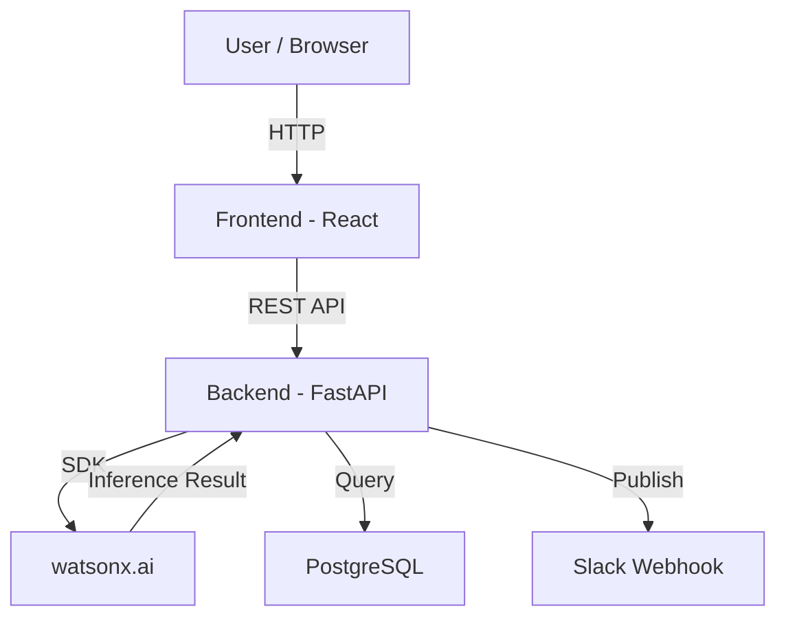
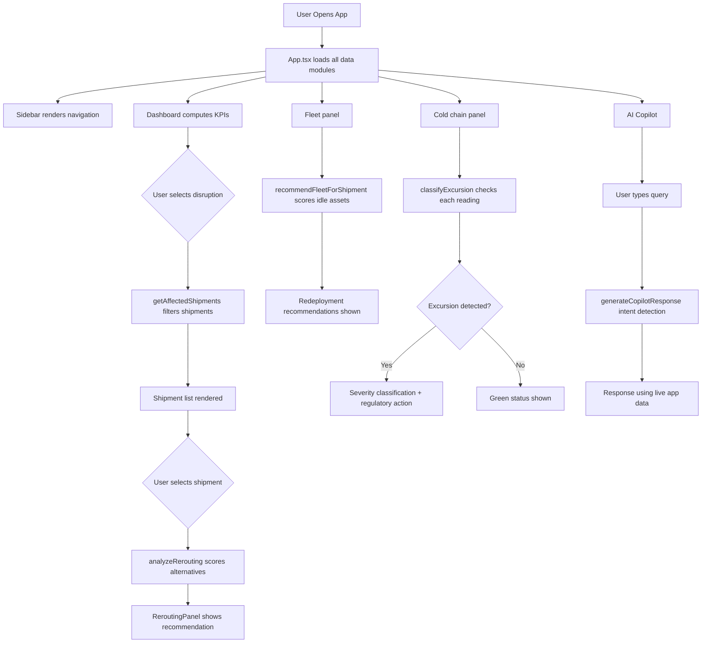
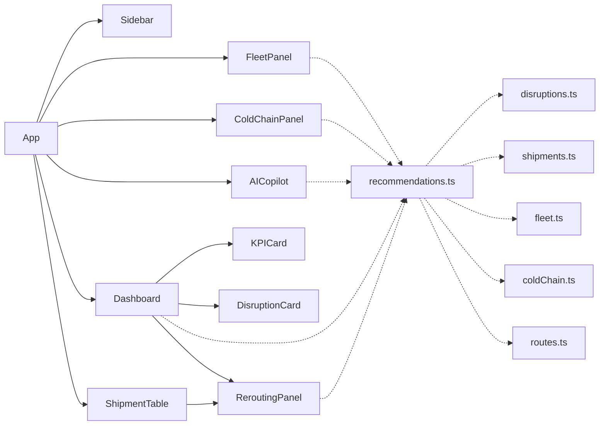

# Architecture

<<<<<<< HEAD
## System Architecture

[Describe the overall architecture of your system. Replace the Mermaid diagram below with your actual architecture.]



## Components

| Component | Technology | Responsibility |
|---|---|---|
| Frontend | [e.g., React 18] | [e.g., Dashboard UI, user interaction] |
| Backend API | [e.g., FastAPI] | [e.g., Business logic, orchestration] |
| AI / ML | [e.g., watsonx.ai] | [e.g., Anomaly scoring, classification] |
| Database | [e.g., PostgreSQL] | [e.g., Storing pipeline events and scores] |
| Notifications | [e.g., Slack API] | [e.g., Alerting on threshold breaches] |

## Data Flow

[Describe how data moves through your system from input to output.]

1. [e.g., Pipeline logs are ingested via a webhook from GitHub Actions]
2. [e.g., Logs are preprocessed and chunked into 512-token segments]
3. [e.g., Each chunk is sent to the watsonx.ai inference endpoint]
4. [e.g., Anomaly scores are stored in PostgreSQL]
5. [e.g., The React dashboard polls the API every 30 seconds to refresh]

## Security Considerations

[Note any security decisions relevant to the architecture — even if basic.]

- [e.g., API keys stored in environment variables, never committed to git]
- [e.g., All API routes require a Bearer token]
- [e.g., Database credentials rotated via IBM Secrets Manager]

## Scalability Notes

[Optional: how would this scale beyond the hackathon prototype?]

[e.g., "The FastAPI backend is stateless and could be horizontally scaled behind a load balancer. The watsonx.ai calls are the bottleneck and would benefit from request batching."]
=======
## SupplyGuard AI — System Architecture

---

## Overview

SupplyGuard AI is a single-page application (SPA) that runs entirely in the browser. There is no backend server. All data is loaded from local TypeScript modules that can be replaced with real API calls without changing the UI layer.

```
┌─────────────────────────────────────────────────────────────────┐
│                        Browser (SPA)                            │
│                                                                 │
│  ┌─────────┐    ┌──────────────────────────────────────────┐   │
│  │ Sidebar │    │              Main View Area               │   │
│  │  Nav    │    │                                          │   │
│  │         │    │  ┌──────────┐  ┌──────────┐             │   │
│  │Dashboard│───▶│  │Dashboard │  │Shipment  │             │   │
│  │Shipments│    │  │(Disruption  │Table     │             │   │
│  │Fleet    │    │  │ KPIs)    │  │(Impact)  │             │   │
│  │Cold     │    │  └──────────┘  └──────────┘             │   │
│  │ Chain   │    │  ┌──────────┐  ┌──────────┐             │   │
│  │Copilot  │    │  │Fleet     │  │Cold Chain│             │   │
│  └─────────┘    │  │Panel     │  │Panel     │             │   │
│                 │  └──────────┘  └──────────┘             │   │
│                 │  ┌─────────────────────────┐            │   │
│                 │  │    AI Copilot Chat       │            │   │
│                 │  └─────────────────────────┘            │   │
│                 └──────────────────────────────────────────┘   │
│                                                                 │
│  ┌──────────────────────────────────────────────────────────┐  │
│  │               Recommendation Engine                      │  │
│  │  analyzeRerouting() · recommendFleetForShipment()        │  │
│  │  classifyExcursion() · generateCopilotResponse()         │  │
│  └──────────────────────────────────────────────────────────┘  │
│                                                                 │
│  ┌──────────────────────────────────────────────────────────┐  │
│  │                   Data Layer (Local TS)                   │  │
│  │  disruptions.ts · routes.ts · shipments.ts               │  │
│  │  fleet.ts · coldChain.ts                                  │  │
│  └──────────────────────────────────────────────────────────┘  │
└─────────────────────────────────────────────────────────────────┘
```

---

## Data Flow



---

## Component Architecture



---

## Components

| Component | File | Responsibility |
|---|---|---|
| `App` | `App.tsx` | Root component, view routing, selected disruption state |
| `Sidebar` | `Sidebar.tsx` | Navigation, live disruption count indicator |
| `Dashboard` | `Dashboard.tsx` | KPI cards, disruption list, affected shipment list |
| `KPICard` | `KPICard.tsx` | Reusable metric display card |
| `DisruptionCard` | `DisruptionCard.tsx` | Single disruption with severity/status badges |
| `ShipmentTable` | `ShipmentTable.tsx` | Filterable shipment table with impact badges |
| `ReroutingPanel` | `ReroutingPanel.tsx` | AI rerouting recommendation with metrics |
| `FleetPanel` | `FleetPanel.tsx` | Fleet status table + redeployment recommendations |
| `ColdChainPanel` | `ColdChainPanel.tsx` | IoT chart + excursion alerts + regulatory classification |
| `AICopilot` | `AICopilot.tsx` | Chat interface, quick questions, top actions sidebar |

---

## Data Modules

| Module | Records | Description |
|---|---|---|
| `disruptions.ts` | 3 disruptions | Mumbai Port Strike (ACTIVE), Cyclone Vayu (MONITORING), NH-48 closure (ACTIVE) |
| `routes.ts` | 8 routes + 6 alternatives | Standard routes with affected disruption IDs, alternative routes with cost/delay/confidence |
| `shipments.ts` | 10 shipments | 4 AFFECTED, 2 AT_RISK, 4 NOT_AFFECTED; includes 2 cold-chain shipments |
| `fleet.ts` | 12 assets | Trucks, containers, vessels; mix of BUSY, IDLE, MAINTENANCE |
| `coldChain.ts` | 3 monitored shipments | MED-001 (SEVERE excursion), MED-002 (compliant), SH-003 (MINOR excursion) |

---

## Recommendation Engine

| Function | Input | Output |
|---|---|---|
| `getAffectedShipments()` | Disruption, all shipments | List of shipments with matching disruption ID |
| `analyzeRerouting()` | Shipment | Best alternative route + scoring breakdown + reasoning |
| `recommendFleetForShipment()` | Shipment, idle assets | Best matched fleet asset + score + reason |
| `classifyExcursion()` | ColdChainShipment | Severity, delta, duration, regulatory action |
| `generateCopilotResponse()` | Query string, full context | Natural language response using live data |
| `generateTopActions()` | Full context | Priority-ranked action list |

---

## Technologies

| Layer | Technology | Version | Purpose |
|---|---|---|---|
| UI Framework | React | 19.x | Component-based UI |
| Language | TypeScript | 6.x | Type safety |
| Build Tool | Vite | 8.x | Fast dev server + production build |
| Styling | Tailwind CSS v4 | 4.x | Utility-first CSS |
| Charts | Recharts | 3.x | Temperature sensor chart |
| Icons | Lucide React | 1.x | UI icons |
| AI Agent | IBM Bob | — | Entire development lifecycle |

---

## Production Upgrade Path

To evolve from MVP to production:

1. **Data layer** — Replace `src/data/*.ts` imports with API calls to a logistics backend
2. **AI Copilot** — Replace `generateCopilotResponse()` body with IBM watsonx or OpenAI call, passing the same context object as the prompt
3. **Real-time** — Add WebSocket or SSE connection for live sensor data and disruption updates
4. **Auth** — Add IBM App ID or Auth0 for multi-user/multi-tenant support
5. **Database** — Store shipment/fleet data in Db2 or MongoDB; sensor readings in TimescaleDB
6. **Deployment** — Build with `npm run build` and deploy `dist/` to any static host or IBM Cloud Object Storage

No changes to the UI components or recommendation engine interface are required for steps 1–2.
>>>>>>> master
